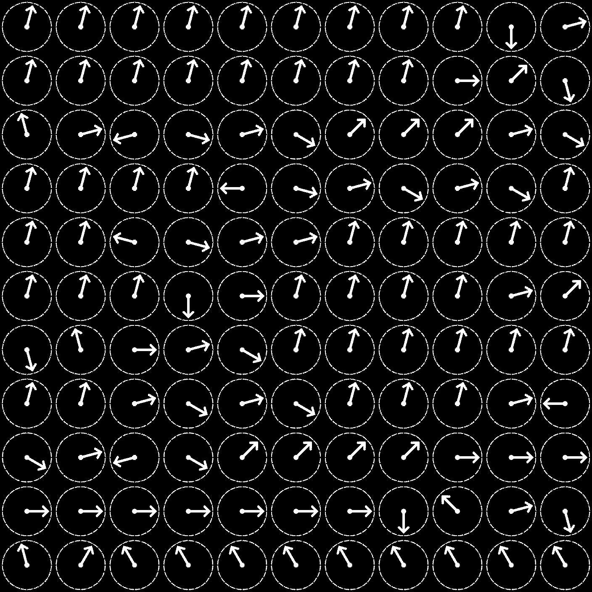

<p align="center">

</p>

# Look at the Time
Look at the Time (or LATT for short), is an esoteric programming language revolving around clocks. Instead of your regular capitalist clock, these clocks have 24 hours instead of 12.

LATT is heavily inspired by the well known esolang brainfuck, but it's even less readable. Every instruction has an ID associated with it. Instructions are represented on the clock by rotating the hand by `ID * 15` degrees

LATT features a list of values, just like the one found in brainfuck. LATT also has 4 slots that you can switch to using their respective instruction. Think of slots as having a left hand to hold extra numbers. And finally, LATT has a whopping 4 different instructions that you can use to compare values!

## Usage
The only thing you need to run LATT is python. If you want to generate the clocks, you'll also need the Pillow library

To run LATT code, pass a text file with mnemonics to `latt.py` (see helloworld.latt). This will also generate a `.rlatt` file

You can then run `toimage.py` on the rlatt file, and it will spit out a png file that you can open using literally any image viewer

Here's what helloworld.latt turns into. Beautiful


## Instruction set
([LATT.txt](https://github.com/cohaereo/latt/blob/master/LATT.txt) might be more up to date)
```
mnemonic    - i  - description

CLEAR       - 00 - clear at ptr
INC         - 01 - increment val by 1
RET         - 02 - exit program and return value at pointer as return code
DEC         - 03 - decrement val by 1
???         - 04 - unused

PINC        - 05 - increment pointer by 1
PDEC        - 06 - decrement pointer by 1

LOAD        - 07 - load into slot
PUT         - 08 - set val to slot
CLSLOT      - 09 - clear slot
QLOAD       - 10 - quick load slot from values[0] (nobody will ever use this lol)

ISZERO      - 11 - flag = (val == 0)

LSTART      - 12 - loop start

ISEQU       - 13 - flag = (val == slot)
ISNEQ       - 14 - flag = (val != slot)
ISGRE       - 15 - flag = (val >  slot)
ISLES       - 16 - flag = (val <  slot)

SLOT0       - 17 - switch to slot 0
SLOT1       - 18 - switch to slot 1
SLOT2       - 19 - switch to slot 2
SLOT3       - 20 - switch to slot 3

OUT         - 21 - print val to stdout as ascii character (72 = 'H')
NOOP        - 22 - noop

LEND        - 23 - loop end, pass if flag = 1, else, jump back to the first loop start in the stack
```